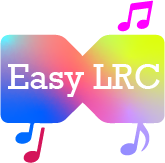
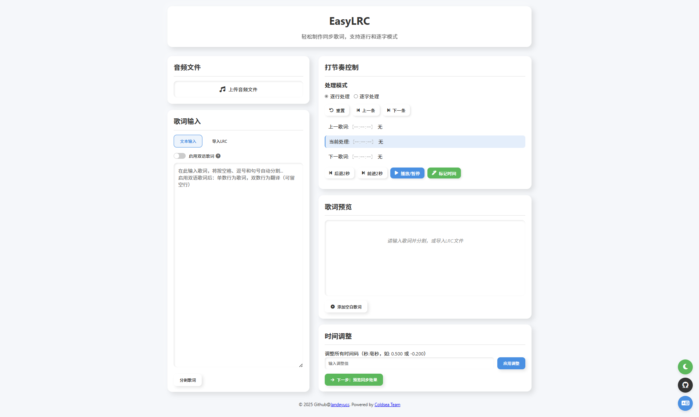

# EasyLRC - Lyric Processing Tool



### Switch Document Language [简体中文](README_CN.md) | [English](README.md)

### Go to [EasyLRC Tool Website](https://lrc.vl-x.vip/)

EasyLRC is a web-based lyric processing tool designed to provide an intuitive and feature-rich LRC creation platform for creating, editing, and synchronizing lyric timestamps. It supports widely adopted LRC standards and is compatible with non-industry standard syntax. It integrates audio playback with synchronized preview functionality and supports parsing and exporting metadata, allowing users to easily create and modify lyric files.



## Key Features

- **Modern UI**: Features a modern, neumorphic UI with a lightweight and clean design, flexible layout, and mobile device compatibility.
- **Lyric Parsing and Editing**: Supports parsing standard and non-standard LRC syntax, allowing users to directly edit lyric content.
- **Timestamp Editing**: Supports marking timestamps by playing audio, and also allows direct editing of timestamps.
- **Convenient Parsing**: Supports dragging files into the window for parsing, and also supports batch parsing, allowing simultaneous selection of lyrics and audio for parsing.
- **Optimized Data Parsing**: Intelligently recognizes LRC syntax (including some non-standard syntax) and intelligently identifies file types.
- **Multi-data Parsing**: Supports parsing bilingual lyrics (e.g., Chinese and English), and supports parsing and exporting metadata (e.g., song title, artist, album, etc., including parsing incorrectly timestamped metadata).
- **Lyric Preview**: Built-in synchronized player supports real-time preview of lyric progress to ensure synchronization with audio.
- **Timestamp Synchronization**: Supports adjusting overall lyric timestamps to ensure perfect synchronization between lyrics and audio.
- **Hotkey Control**: Supports controlling timestamp marking, audio progress, and playback events via hotkeys.
- **Multi-language Support**: Interface and prompt messages support Chinese (Simplified), Chinese (Traditional), and English.
- **Theme Switching**: Supports light and dark themes, providing a personalized visual experience.

## Hotkey Support

- **Select File**: `ALT + O`
- **Mark Timestamp**: `Space`
- **Play/Pause**: `ALT + Enter`
- **Forward 2 seconds**: `N`
- **Rewind 2 seconds**: `B`
- **Switch to next lyric**: `ALT+N`
- **Switch to previous lyric**: `ALT+B`

## Parsing Support

#### Standard - LRC Syntax:
```lrc
[00:00.00] This is the first line of lyrics
[00:01.00] This is the second line of lyrics
```
#### Standard Syntax - Bilingual LRC Syntax:
```lrc
[00:00.00] 这是第一行
[00:00.00] Is first line
```
#### Non-standard Syntax - Bilingual LRC Syntax:

```lrc
[00:00.00] 这是第一行 / Is first line
[00:01.00] 这是第二行 / Is second line
```
#### Non-standard Syntax - Word-by-word Parsing LRC Syntax:

```lrc
[00:30.20]<00:30.20>这<00:30.50>是<00:30.80>第<00:31.40>一<00:31.70>行<00:32.00>
[00:32.20]<00:32.20>这<00:32.50>是<00:32.80>第<00:33.40>二<00:33.70>行<00:33.00>
```

#### Metadata Parsing
 ```txt
 [ar:Artist]
[ti:Song Title]
[al:Album Name]
[by:Lyric Creator/Editor]
[offset:Time Offset (milliseconds)]
[length:Total Song Duration]
[au:Singer (detailed)]
[re:Arranger]
[ve:Version Information]
[composer:Composer]
[lyricist:Lyricist]
[translator:Translator (bilingual scenario)]
[language:Lyric Language]
```

## Installation and Running

EasyLRC is a web-based application that requires no complex installation steps. You can run it in the following ways:

1.  **Directly open `index.html`**:
    - Clone or download this project to your local computer.
    - Directly open the `index.html` file in the project root directory in your browser.

2.  **Run via a local server (recommended)**:
    - For the best experience and to avoid potential browser security restrictions (e.g., certain API limitations under the file protocol), it is recommended to run it via a local web server.
    - You can use any simple HTTP server, such as Python's `http.server` module:
        ```bash
        cd /path/to/EasyLRC
        python -m http.server 8000
        ```
    - Then visit `http://localhost:8000` in your browser.

## Project Structure

```
. # Project root directory  
├── css/              # Stylesheets
│   └── styles.css    # Main stylesheet
├── icon/             # Icon files
│   ├── EasyLRC.ai    # Adobe Illustrator source file
│   ├── EasyLRC.svg   # SVG icon file
│   ├── EasyLRC.ico   # ICO icon file
│   ├── EasyLRC.png   # PNG icon file
├── js/               # JavaScript script files
│   ├── audioHandler.js       # Audio processing logic
│   ├── languageController.js # Multi-language control logic
│   ├── lyricHandler.js       # Lyric processing logic
│   ├── main.js               # Main application entry
│   ├── themeController.js    # Theme switching logic
│   ├── timeHandler.js        # Time formatting and processing logic
│   └── uiController.js       # User interface control logic
├── lang/             # Language files
│   ├── en-US.js      # English language pack
│   ├── zh-CN.js      # Simplified Chinese language pack
│   └── zh-TW.js      # Traditional Chinese language pack
├── test_lrc/         # Test lyric files
├── index.html        # Main page file
└── README.md         # Project README file
```

## Contribution

Contributions to this project are welcome! If you have any suggestions, bug reports, or feature requests, feel free to submit an Issue or Pull Request.

## License

This project is open-sourced under the MIT License. Please refer to the `LICENSE` file for details.

## Acknowledgements
This project initially received inspiration from the [lrc_editor](https://github.com/yiyizym/lrc_editor) project. I would like to express my gratitude to this project for providing me with the inspiration and ideas that helped me develop this project.
