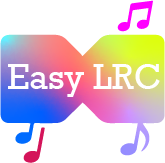
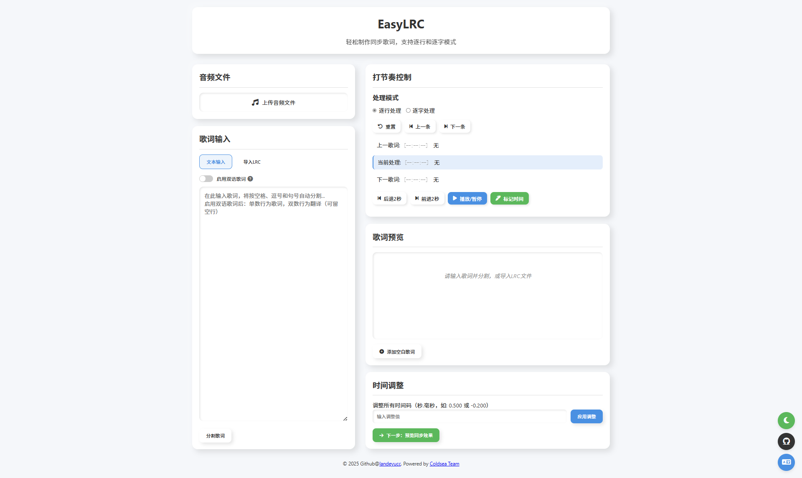

# EasyLRC - Lyric Processing Tool



### Switch Document Language [简体中文](README_CN.md) | [English](README.md)

### Go to [EasyLRC Tool Website](https://lrc.isea.dev/)

## Overview

EasyLRC is a web-based lyric processing tool designed to provide an intuitive and feature-rich LRC creation platform for creating, editing, and synchronizing lyric timestamps. It supports widely adopted LRC standards and is compatible with non-industry standard syntax. It integrates audio playback with synchronized preview functionality and supports parsing and exporting metadata, allowing users to easily create and modify lyric files.



## Key Features

- **Modern UI**: Features a modern, neumorphic UI with a lightweight and clean design, flexible layout, and mobile device compatibility.
- **Lyric Parsing and Editing**: Supports parsing standard and non-standard LRC syntax, allowing users to directly edit lyric content.
- **Timestamp Editing**: Supports marking timestamps by playing audio, and also allows direct editing of timestamps.
- **Convenient Parsing**: Supports dragging files into the window for parsing, and also supports batch parsing, allowing simultaneous selection of lyrics and audio for parsing.
- **Optimized Data Parsing**: Intelligently recognizes LRC syntax (including some non-standard syntax) and intelligently identifies file types.
- **Multi-data Parsing**: Supports parsing bilingual lyrics (e.g., Chinese and English), and supports parsing and exporting metadata (e.g., song title, artist, album, etc., including parsing incorrectly timestamped metadata).
- **Lyric Preview**: Built-in synchronized player supports real-time preview of lyric progress to ensure synchronization with audio.
- **Timestamp Synchronization**: Supports adjusting overall lyric timestamps to ensure perfect synchronization between lyrics and audio.
- **Audio Data Validation**: Supports analyzing audio data to validate and optimize lyric timestamps for better synchronization.
- **Hotkey Control**: Supports controlling timestamp marking, audio progress, and playback events via hotkeys.
- **Multi-language Support**: Interface and prompt messages support Chinese (Simplified), Chinese (Traditional), and English.
- **Theme Switching**: Supports light and dark themes, providing a personalized visual experience.

## Hotkey Support

### Basic Controls

- **Open File**: `ALT + O`
- **Mark Timestamp**: `Space`
- **Play/Pause**: `ALT + Enter`
- **Forward 2 seconds**: `N`
- **Rewind 2 seconds**: `B`
- **Switch to next lyric**: `ALT+N`
- **Switch to previous lyric**: `ALT+B`
- **Toggle left panel**: `ALT+M`
- **Adjust current lyric time (left)**: `Left Arrow`
- **Adjust current lyric time (right)**: `Right Arrow`

## Parsing Support

### Standard LRC Syntax:

```lrc
[00:00.00] This is the first line of lyrics
[00:01.00] This is the second line of lyrics
```

### Bilingual LRC Syntax (Standard):

```lrc
[00:00.00] 这是第一行
[00:00.00] Is first line
```

### Bilingual LRC Syntax (Non-standard):

```lrc
[00:00.00] 这是第一行 / Is first line
[00:01.00] 这是第二行 / Is second line
```

### Word-by-word Parsing LRC Syntax:

```lrc
[00:30.20]<00:30.20>这<00:30.50>是<00:30.80>第<00:31.40>一<00:31.70>行<00:32.00>
[00:32.20]<00:32.20>这<00:32.50>是<00:32.80>第<00:33.40>二<00:33.70>行<00:33.00>
```

### Metadata Parsing

```txt
[ar:Artist]
[ti:Song Title]
[al:Album Name]
[by:Lyric Creator/Editor]
[offset:Time Offset (milliseconds)]
[length:Total Song Duration]
[au:Singer (detailed)]
[re:Arranger]
[ve:Version Information]
[composer:Composer]
[lyricist:Lyricist]
[translator:Translator (bilingual scenario)]
[language:Lyric Language]
```

## How to Use

### Basic Workflow

1. **Upload Files**: Drag and drop lyric and audio files into the interface, or use `ALT + O` to open the file selector.
2. **Edit Lyrics**: Modify lyric content directly in the editor.
3. **Mark Timestamps**: Play the audio and press `Space` to mark timestamps for each lyric line.
4. **Preview**: Use the built-in player to preview the synchronized lyrics.
5. **Validate**: Click "Audio Data Validation Time" to automatically validate and optimize timestamps.
6. **Export**: Copy the processed lyrics or download them as an LRC file.

## Installation and Running

EasyLRC is a web-based application that requires no complex installation steps. You can run it in the following ways:

1.  **Directly open `index.html`**:
    - Clone or download this project to your local computer.
    - Directly open the `index.html` file in the project root directory in your browser.

2.  **Run via a local server (recommended)**:
    - For the best experience and to avoid potential browser security restrictions (e.g., certain API limitations under the file protocol), it is recommended to run it via a local web server.
    - You can use any simple HTTP server, such as Python's `http.server` module:
      ```bash
      cd /path/to/EasyLRC
      python -m http.server 8000
      ```
    - Then visit `http://localhost:8000` in your browser.

## Contribution

Contributions to this project are welcome! If you have any suggestions, bug reports, or feature requests, feel free to submit an Issue or Pull Request.

## License

This project is open-sourced under the MIT License. Please refer to the `LICENSE` file for details.

## Thanks

This project initially received inspiration from the [lrc_editor](https://github.com/yiyizym/lrc_editor) project. I would like to express my gratitude to this project for providing me with the inspiration and ideas that helped me develop this project.

Thanks to @hetai9z for their [suggestion](https://github.com/hetai9z/EasyLRC/issues/26), which helped me improve and optimize the project in version 26.3.18.
