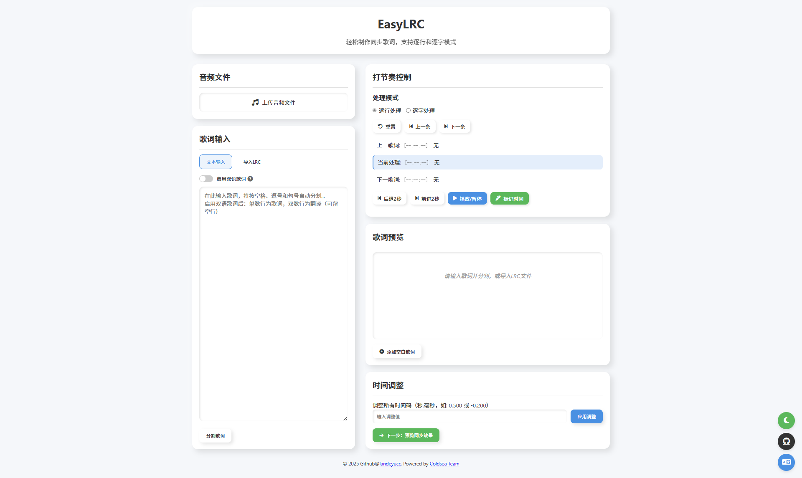

# EasyLRC - 歌词处理工具


### 切换文档语言 [简体中文](README_CN.md) | [English](README.md)

### 前往 [EasyLRC 工具网站](https://lrc.isea.dev/)

## 项目概述

EasyLRC 是一个基于 Web 的歌词处理工具，旨在提供一个直观且功能丰富的LRC制作平台，用于创建、编辑和同步歌词的时间码。它支持LRC所广泛支持的标准与兼容非行业标准的语法，并集成了音频播放并同步预览功能，并且支持解析并导出元数据，使用户能够轻松地创建和修改歌词文件。



## 主要功能

- **现代化UI**: 使用现代化拟态UI，轻量简洁设计，弹性布局，兼容移动设备。
- **全局参数控制**：集中管理处理模式与逐字选项，一目了然。
- **处理模式切换**：支持**逐行**与**逐字**两种时间标记模式，快捷键行为随模式自动切换。
- **逐字处理优化**：逐字模式下支持**自动跳过空格**与**英文单词处理**两种辅助选项；开启单词处理后，空格键一次标记整词而非单字母。
- **歌词解析编辑**：支持解析LRC标准语法与非标准，用户可直接编辑歌词内容。
- **时间码编辑**：支持通过播放音频打TAG标记时间，也可直接编辑时间码；时间调整与音频校验会同步更新逐字时间标记。
- **便捷解析**：支持拖入窗口解析文件，更支持批量解析，可同时选中歌词与音频进行解析。
- **数据解析优化**：智能识别LRC语法（支持部分非标准的语法），智能识别文件类型。
- **多数据解析**：支持解析双语歌词（如中文与英文），并支持解析并导出元数据（如歌曲标题、歌手、专辑等，并且支持解析错误的添加了时间码的元数据）。
- **歌词预览**：内置同步播放器，支持实时预览歌词进度是否与音频同步；逐字模式下**不会因下一行行级时间戳提前截断**，保证整行逐字高亮有完整播放窗口。
- **时间码同步**：支持调整整体的歌词时间码，确保歌词与音频的完美同步；**整体时间调整会同步作用于逐字时间戳**。
- **音频数据校验**：支持分析音频数据，验证并优化歌词时间码，提高同步精度；校验/撤销均完整覆盖逐字时间戳。
- **快捷键控制**：支持通过快捷键控制打TAG标记时间与音频进度与播放事件的控制；退字（Alt+B / ArrowUp）会同时撤销上一个字/词的标记。
- **多语言支持**：界面和提示信息支持中文（简体）、中文（繁体）和英文；**上一字 / 上一词 / 下一字 / 下一词**按钮文案随处理模式自动切换。
- **主题切换**：支持明亮和黑暗主题，提供个性化的视觉体验。

## 快捷键支持

### 基本控制

> 上下左右键控制可在设置内开启“使用小键盘前进撤销（交换方向键功能）”功能
- **打开文件**：`ALT + O`
- **打TAG标记时间**：`Space`
- **播放/暂停**：`ALT + Enter`
- **前进2秒**：`N`
- **后退2秒**：`B`
- **切换左侧面板**：`ALT+M`
- **调整当前歌词时间（左 -200ms）**：`Left Arrow`
- **调整当前歌词时间（右 +200ms）**：`Right Arrow`

### 逐行处理模式

- **切至上一歌词**：`ALT + B` 或 `ArrowUp`
- **切至下一歌词**：`ALT + N` 或 `ArrowDown`

### 逐字处理模式

逐字模式下，`Alt+B / ArrowUp` 会**撤销上一个字（或单词）的时间标记**并光标回退；当整行标记被撤空后自动跳到上一行末尾继续。按钮区的**上一条/下一条**始终做行级跳转，独立提供**上一字/下一字**按钮用于逐字进退。

- **退字 / 退词（带撤销）**：`ALT + B` 或 `ArrowUp`
- **进字 / 进词**：`ALT + N` 或 `ArrowDown`
- **上一条 / 下一条**：切换行，但不撤销上一个字/词的时间标记

## 解析支持

### 标准LRC语法：

```lrc
[00:00.00] 这是第一行歌词
[00:01.00] 这是第二行歌词
```

### 双语LRC语法（标准）：

```lrc
[00:00.00] 这是第一行歌词
[00:00.00] Is first line
```

### 双语LRC语法（非标准）：

```lrc
[00:00.00] 这是第一行歌词 / Is first line
[00:01.00] 这是第二行歌词 / Is second line
```

### 逐字解析LRC语法（卡拉OK常用）：

```lrc
[00:30.20]<00:30.20>这<00:30.50>是<00:30.80>第<00:31.40>一<00:31.70>行<00:32.00>
[00:32.20]<00:32.20>这<00:32.50>是<00:32.80>第<00:33.40>二<00:33.70>行<00:33.00>
```

### 元数据解析

```txt
[ar:歌手/艺术家]
[ti:歌曲名/标题]
[al:专辑名]
[by:歌词制作/编辑者]
[offset:时间偏移量（毫秒）]
[length:歌曲总时长]
[au:演唱者（细分）]
[re:编曲者]
[ve:版本信息]
[composer:作曲者]
[lyricist:作词人]
[translator:翻译者（双语场景）]
[language:歌词语言]
```

## 使用方法

### 基本工作流程

1. **上传文件**：将歌词和音频文件拖放到界面中，或使用 `ALT + O` 打开文件选择器。
2. **编辑歌词**：在编辑器中直接修改歌词内容。
3. **标记时间码**：播放音频并按 `Space` 键为每句歌词标记时间码。
4. **预览**：使用内置播放器预览同步后的歌词。
5. **校验**：点击"音频数据校验时间"按钮自动验证并优化时间码。
6. **导出**：复制处理后的歌词或下载为LRC文件。

## 安装与运行

EasyLRC 是一个基于 Web 的应用，无需复杂的安装步骤。您可以通过以下方式运行它：

1.  **直接打开 `index.html`**：
    - 克隆或下载本项目到您的本地计算机。
    - 在浏览器中直接打开项目根目录下的 `index.html` 文件即可。

2.  **通过本地服务器运行（推荐）**：
    - 为了获得最佳体验和避免潜在的浏览器安全限制（例如，文件协议下的某些API限制），建议通过本地 Web 服务器运行。
    - 您可以使用任何简单的 HTTP 服务器，例如 Python 的 `http.server` 模块：
      ```bash
      cd /path/to/EasyLRC
      python -m http.server 8000
      ```
    - 然后在浏览器中访问 `http://localhost:8000`。

## 贡献

欢迎对本项目进行贡献！如果您有任何建议、bug 报告或功能请求，请随时提交 Issue 或 Pull Request。

## 许可证

本项目采用 MIT 许可证进行开源。详情请参阅 `LICENSE` 文件。

## 致谢

本项目最初的灵感来自于 [lrc_editor](https://github.com/yiyizym/lrc_editor) 项目，感谢此项目为本人提供灵感，本项目完全重构不涉及他人作品。

感谢来自 [@hetai9z](https://github.com/hetai9z) 的[建议](https://github.com/landeyucc/EasyLRC/issues/1)，本项目在其26.3.18版本对提出的建议进行了完善和优化。
感谢来自 [@JavaCoffeePro](https://github.com/JavaCoffeePro) 的[建议](https://github.com/landeyucc/EasyLRC/issues/2)，本项目在其26.9.08版本对提出的建议进行了完善和优化。
