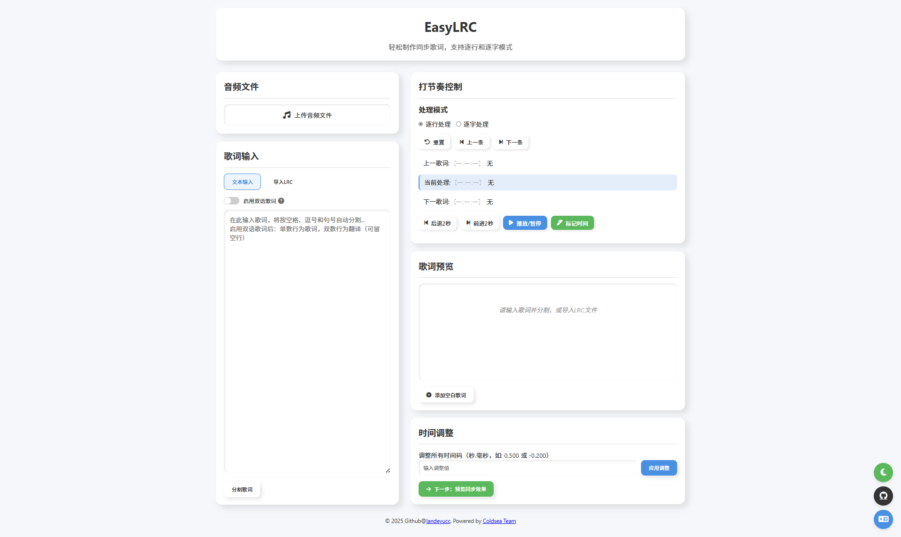

# EasyLRC - 歌词处理工具


### 切换文档语言 [简体中文](README_CN.md) | [English](README.md)

### 前往 [EasyLRC 工具网站](https://lrc.vl-x.vip/)

EasyLRC 是一个基于 Web 的歌词处理工具，旨在提供一个直观且功能丰富的LRC制作平台，用于创建、编辑和同步歌词的时间码。它支持LRC所广泛支持的标准与兼容非行业标准的语法，并集成了音频播放并同步预览功能，并且支持解析并导出元数据，使用户能够轻松地创建和修改歌词文件。



## 主要功能

- **现代化UI**: 使用现代化拟态UI，轻量简洁设计，弹性布局，兼容移动设备。
- **歌词解析编辑**：支持解析LRC标准语法与非标准，用户可直接编辑歌词内容。
- **时间码编辑**：支持通过播放音频打TAG标记时间，也可直接编辑时间码。
- **便捷解析**：支持拖入窗口解析文件，更支持批量解析，可同时选中歌词与音频进行解析。
- **数据解析优化**：智能识别LRC语法（支持部分非标准的语法），智能识别文件类型。
- **多数据解析**：支持解析双语歌词（如中文与英文），并支持解析并导出元数据（如歌曲标题、歌手、专辑等，并且支持解析错误的添加了时间码的元数据）。
- **歌词预览**：内置同步播放器，支持实时预览歌词进度是否与音频同步。
- **时间码同步**：支持调整整体的歌词时间码，确保歌词与音频的完美同步。
- **快捷键控制**：支持通过快捷键控制打TAG标记时间与音频进度与播放事件的控制。
- **多语言支持**：界面和提示信息支持中文（简体）、中文（繁体）和英文。
- **主题切换**：支持明亮和黑暗主题，提供个性化的视觉体验。

## 快捷键支持

- **选中文件**：`ALT + O`
- **打TAG标记时间**：`Space`
- **播放/暂停**：`ALT + Enter`
- **前进2秒**：`N`
- **后退2秒**：`B`
- **切换至下一歌词**：`ALT+N`
- **切换至上一歌词**：`ALT+B`

## 解析支持

#### 标准——LRC语法：
```lrc
[00:00.00] 这是第一行歌词
[00:01.00] 这是第二行歌词
```
#### 标准语法——双语LRC语法：
```lrc
[00:00.00] 这是第一行歌词
[00:00.00] Is first line
```
#### 非标准语法——双语LRC语法：

```lrc
[00:00.00] 这是第一行歌词 / Is first line
[00:01.00] 这是第二行歌词 / Is second line
```
#### 非标准语法——逐字解析LRC语法：

```lrc
[00:30.20]<00:30.20>这<00:30.50>是<00:30.80>第<00:31.40>一<00:31.70>行<00:32.00>
[00:32.20]<00:32.20>这<00:32.50>是<00:32.80>第<00:33.40>二<00:33.70>行<00:33.00>
```

#### 元数据解析
 ```txt
 [ar:歌手/艺术家]
[ti:歌曲名/标题]
[al:专辑名]
[by:歌词制作/编辑者]
[offset:时间偏移量（毫秒）]
[length:歌曲总时长]
[au:演唱者（细分）]
[re:编曲者]
[ve:版本信息]
[composer:作曲者]
[lyricist:作词人]
[translator:翻译者（双语场景）]
[language:歌词语言]
```

## 安装与运行

EasyLRC 是一个基于 Web 的应用，无需复杂的安装步骤。您可以通过以下方式运行它：

1.  **直接打开 `index.html`**：
    - 克隆或下载本项目到您的本地计算机。
    - 在浏览器中直接打开项目根目录下的 `index.html` 文件即可。

2.  **通过本地服务器运行（推荐）**：
    - 为了获得最佳体验和避免潜在的浏览器安全限制（例如，文件协议下的某些API限制），建议通过本地 Web 服务器运行。
    - 您可以使用任何简单的 HTTP 服务器，例如 Python 的 `http.server` 模块：
        ```bash
        cd /path/to/0xl_lrc
        python -m http.server 8000
        ```
    - 然后在浏览器中访问 `http://localhost:8000`。

## 项目结构

```
. # 项目根目录  
├── css/              # 样式文件
│   └── styles.css    # 主样式表
├── icon/             # 图标文件
│   ├── EasyLRC.ai    # Adobe Illustrator源文件
│   ├── EasyLRC.svg   # SVG图标文件
│   ├── EasyLRC.ico   # ICO图标文件
│   ├── EasyLRC.png   # PNG图标文件
├── js/               # JavaScript 脚本文件
│   ├── audioHandler.js       # 音频处理逻辑
│   ├── languageController.js # 多语言控制逻辑
│   ├── lyricHandler.js       # 歌词处理逻辑
│   ├── main.js               # 主应用程序入口
│   ├── themeController.js    # 主题切换逻辑
│   ├── timeHandler.js        # 时间格式化和处理逻辑
│   └── uiController.js       # 用户界面控制逻辑
├── lang/             # 语言文件
│   ├── en-US.js      # 英文语言包
│   ├── zh-CN.js      # 简体中文语言包
│   └── zh-TW.js      # 繁体中文语言包
├── test_lrc/         # 测试歌词文件
├── index.html        # 主页面文件
└── README.md         # 项目说明文件
```

## 贡献

欢迎对本项目进行贡献！如果您有任何建议、bug 报告或功能请求，请随时提交 Issue 或 Pull Request。

## 许可证

本项目采用 MIT 许可证进行开源。详情请参阅 `LICENSE` 文件。